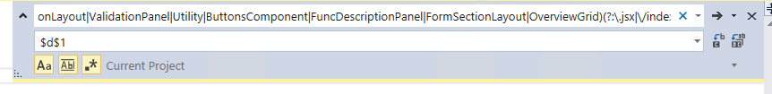
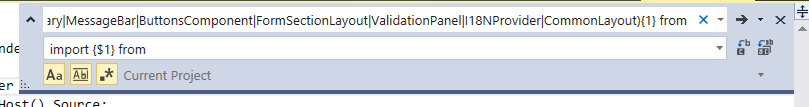

# $d 的替换

## 抽离的模块
```javascript
export * from '../Component/Common/ScheduleList';
export * from '../Component/Common/I18NProvider.jsx';
export * from '../Component/Common/Progress.jsx';
export * from '../Component/Chart.jsx';
export * from'../Component/TableView.jsx';
export * from'../Component/WizardSummary.jsx';
export * from'../Component/MessageBar.jsx';
require('../TreeAUI/tree.jsx')

export * from '../../../../VCControlService/ControlPanel.Html/JSX/Module/StorageConfiguration/CommonLayout/CommonLayout.jsx';
export * from '../../../../VCControlService/ControlPanel.Html/JSX/Components/ValidationPanel.jsx';
export * from '../../../../VCControlService/ControlPanel.Html/JSX/Utility/index.jsx';
export * from '../../../../VCControlService/ControlPanel.Html/JSX/Components/ButtonsComponent.jsx';
//export {FuncDescriptionPanel} from '../../../../VCControlService/ControlPanel.Html/JSX/Components/FuncDescriptionPanel.jsx';
export * from '../../../../VCControlService/ControlPanel.Html/JSX/Components/Layouts/FormSectionLayout.jsx';
export * from '../../../../VCControlService/ControlPanel.Html/JSX/Module/StorageConfiguration/CommonLayout/OverviewGrid.jsx';
```
## 施工步骤
### 将 import xxx from 'xxxxxxxxxxxxxxxxxxxxxxxxxxxxx' 改为 import xxx from "$d"
```javascript
//完成本步骤的正则
/(?:(?:\.\.\/)|\.\/)+(?:.*\/)*(?:ScheduleList|I18NProvider|Progress|Chart|TableView|WizardSummary|MessageBar|CommonLayout|ValidationPanel|Utility|ButtonsComponent|FormSectionLayout|OverviewGrid)(?:\.jsx|\/index.jsx|\/index)?(\'|\")/
```
然后在CP 工程下replace $d$1


### 将 import xx from 'xxxxxx' 改为 import {xxx} from 'xxx'
```javascript
//完成本步骤的正则
/import (TableView|WizardSummary|MessageBar|Progress|ButtonsComponent|FormSectionLayout|ValidationPanel|I18NProvider|CommonLayout){1} from/
```
然后在CP 工程下replace import {$1} from

原因：这些作为公共的模块的有的是以这两种形式（exprot default & module.exports）导出的都被我改成 exprot{ moduleNmae}的形式。 

所以引入的时候就必须改为 import {moduleName} from "$d" 的形式，
大家之前 import xxx from 'xxxxxxxxx' 起个别名的方式就会失效 。
## 新添加了两个打包命令
```bash
$ gulp build:common //build common component
$ gulp build:cp //build cp
$ gulp build //build 所有